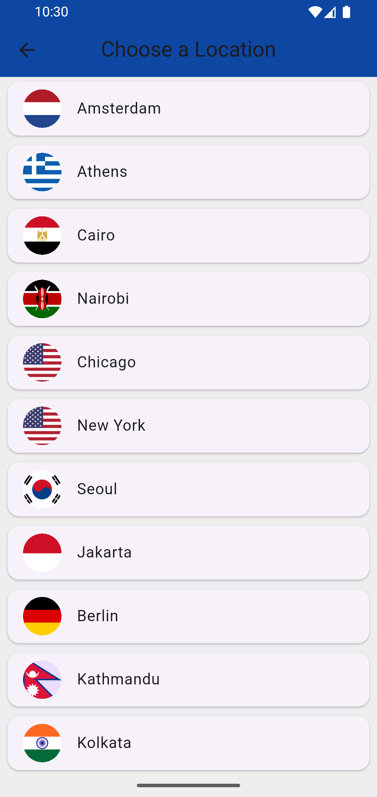
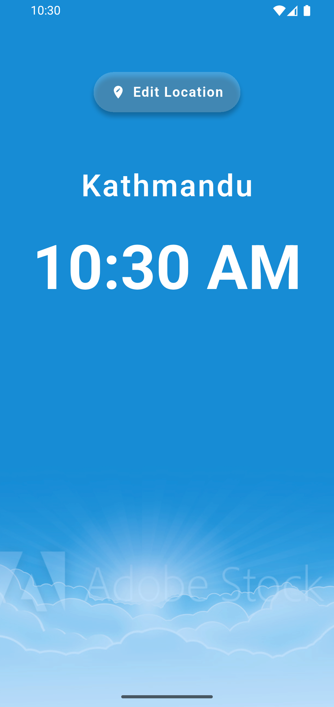
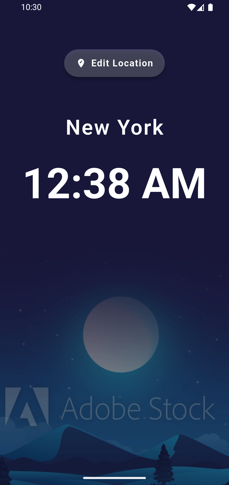

# 🌍 World Time Application

A lightweight Flutter app that fetches and displays the current time for any city in the world using a REST API. Built by following [The Net Ninja's Flutter World Time tutorial series](https://www.youtube.com/watch?v=1ukSR1GRtMU&list=PL4cUxeGkcC9jLYyp2Aoh6hcWuxFDX6PBJ), this project helped me understand asynchronous programming, routing, and API integration in Flutter.

---

## 🚀 Features

- 🌐 Fetches real-time data from [World Time API](http://worldtimeapi.org/)
- 📍 Select from multiple locations
- 🕒 Displays local time with dynamic day/night UI
- 🚦 Shows loading indicator while fetching data
- 📱 Simple and responsive Material UI

---

## 📸 Screenshots (Coming Soon)

> Add screenshots in `assets/screenshots/` and link them here:
<!-- 




-->

---

## 🧰 Tech Stack

- **Flutter** (Dart)
- **HTTP** package for API calls
- **Material Design**

---

## 📁 Project Structure

You said:
https://github.com/iamdipesh18/world_time_application

i want a readme thing for my github

something like this:

# ☕ My Tea Ghar

A minimalist Flutter app built while following [The Net Ninja's Flutter Firebase tutorial series](https://www.youtube.com/playlist?list=PL4cUxeGkcC9j--TKIdkb3ISfRbJeJYQwC). It demonstrates Firebase Authentication, Cloud Firestore, and state management using Provider.

---

## 🚀 Features

- 🔐 Firebase Authentication (Email & Password)
- ☁️ Realtime Firestore integration
- 🧠 State Management using Provider
- 🛠 Custom Brew Settings per user
- 📱 Clean UI built with Material Design

---

## 📸 Screenshots (Currently Working on it!)

> Add screenshots in assets/screenshots/ and link them here:
<!-- 


-->

---

## 🧰 Tech Stack

- **Flutter** (Dart)
- **Firebase Auth** & **Cloud Firestore**
- **Provider** for state management

---

## 🛠️ Getting Started

## 📁 Project Structure

lib/

├── main.dart              # App entry point

├── models/                # User and Brew models

├── screens/               # UI screens

├── services/              # Firebase Auth & Database services

├── shared/                # Common widgets and constants

└── widgets/               # Custom reusable widgets

## 🙏 Acknowledgements

This app was built by following the excellent **Flutter & Firebase App Build Tutorial** series by [The Net Ninja](https://www.youtube.com/playlist?list=PL4cUxeGkcC9j--TKIdkb3ISfRbJeJYQwC). Big thanks to Shaun for the well-structured and beginner-friendly content!

Additional thanks to:
- **Flutter** team for their amazing cross-platform framework
- **Firebase** team for providing powerful backend services

## 📄 License

This project is licensed under the [MIT License](LICENSE).


## 💬 Feedback or Contributions

Found a bug, have a suggestion, or want to contribute? Feel free to:

- ⭐ Star the repo to show your support
- 🐛 [Open an issue](https://github.com/iamdipesh18/my_tea_ghar/issues) for bugs or ideas
- 📥 Fork the repo and submit a pull request

I'd love to hear your thoughts and improvements to make this project even better!


## Live Demo (Currently Working on it!)

### 1. Prerequisites

- Flutter SDK installed ([Installation Guide](https://flutter.dev/docs/get-started/install))
- Firebase account

### 2. Clone and Run

bash
git clone https://github.com/iamdipesh18/my_tea_ghar.git
cd my_tea_ghar
flutter pub get
flutter run


even this world time api i learned from net ninja https://www.youtube.com/watch?v=1ukSR1GRtMU&list=PL4cUxeGkcC9jLYyp2Aoh6hcWuxFDX6PBJ


ChatGPT said:
Great! Here's a customized README.md for your World Time Application inspired by your My Tea Ghar README and the tutorial you followed:

markdown
Copy
Edit
# 🌍 World Time Application

A lightweight Flutter app that fetches and displays the current time for any city in the world using a REST API. Built by following [The Net Ninja's Flutter World Time tutorial series](https://www.youtube.com/watch?v=1ukSR1GRtMU&list=PL4cUxeGkcC9jLYyp2Aoh6hcWuxFDX6PBJ), this project helped me understand asynchronous programming, routing, and API integration in Flutter.

---

## 🚀 Features

- 🌐 Fetches real-time data from [World Time API](http://worldtimeapi.org/)
- 📍 Select from multiple locations
- 🕒 Displays local time with dynamic day/night UI
- 🚦 Shows loading indicator while fetching data
- 📱 Simple and responsive Material UI

---

## 📸 Screenshots (Coming Soon)

> Add screenshots in `assets/screenshots/` and link them here:
<!-- 


-->

---

## 🧰 Tech Stack

- **Flutter** (Dart)
- **HTTP** package for API calls
- **Material Design**

---

## 📁 Project Structure

lib/

├── main.dart # App entry point

├── services/

│ └── world_time.dart # Logic for fetching time from API

├── pages/

│ ├── home.dart # Main screen showing time

│ ├── loading.dart # Loading screen with spinner

│ └── choose_location.dart # Select city to display time

└── utilities/

└── time_helper.dart # (Optional helper logic for formatting)


-------------------

## 🙏 Acknowledgements

This app was built while following the excellent World Time App Tutorial by The Net Ninja. Huge thanks to Shaun for breaking down the concepts so clearly!

Special shoutout to:

- Flutter team for their intuitive UI framework

- WorldTimeAPI for free public access to time data

---

## 💬 Feedback or Contributions

Found a bug, have a suggestion, or want to contribute? Feel free to:

- ⭐ Star the repo to show your support
- 🐛 [Open an issue](https://github.com/iamdipesh18/my_tea_ghar/issues) for bugs or ideas
- 📥 Fork the repo and submit a pull request

I'd love to hear your thoughts and improvements to make this project even better!

---

## 📄 License

This project is licensed under the [MIT License](LICENSE).


---

## 🛠️ Getting Started

### 1. Prerequisites

- Flutter SDK ([Installation Guide](https://flutter.dev/docs/get-started/install))

### 2. Clone & Run

```bash
git clone https://github.com/iamdipesh18/world_time_application.git
cd world_time_application
flutter pub get
flutter run


